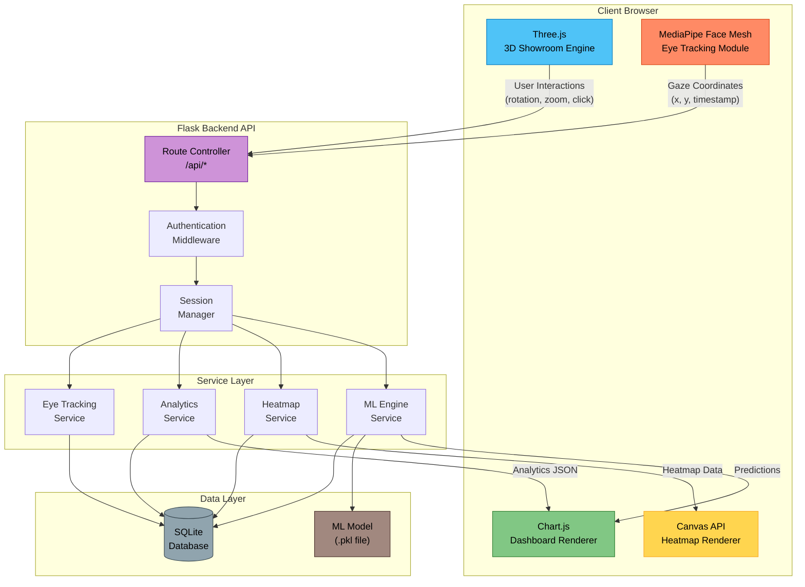
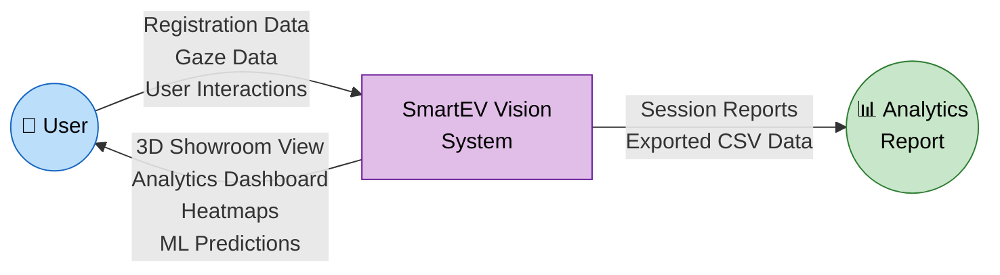
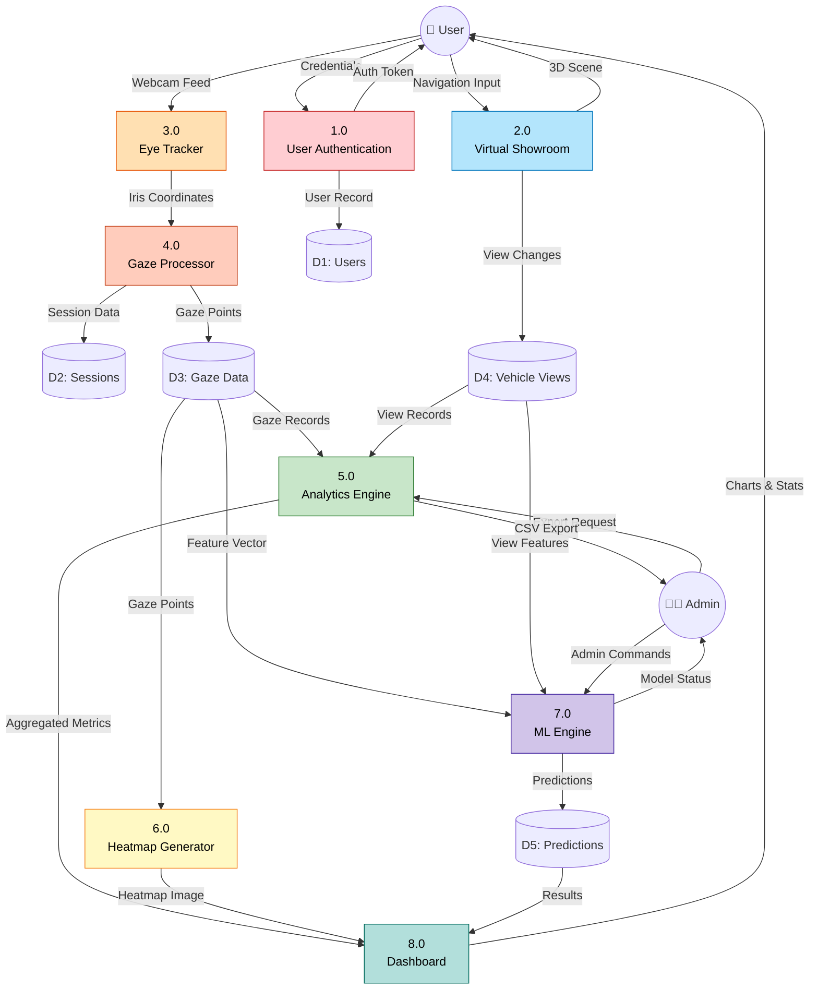
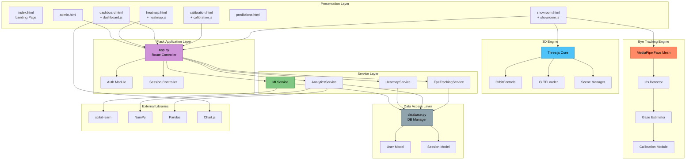
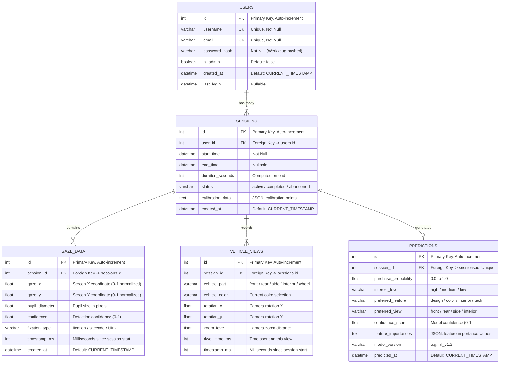
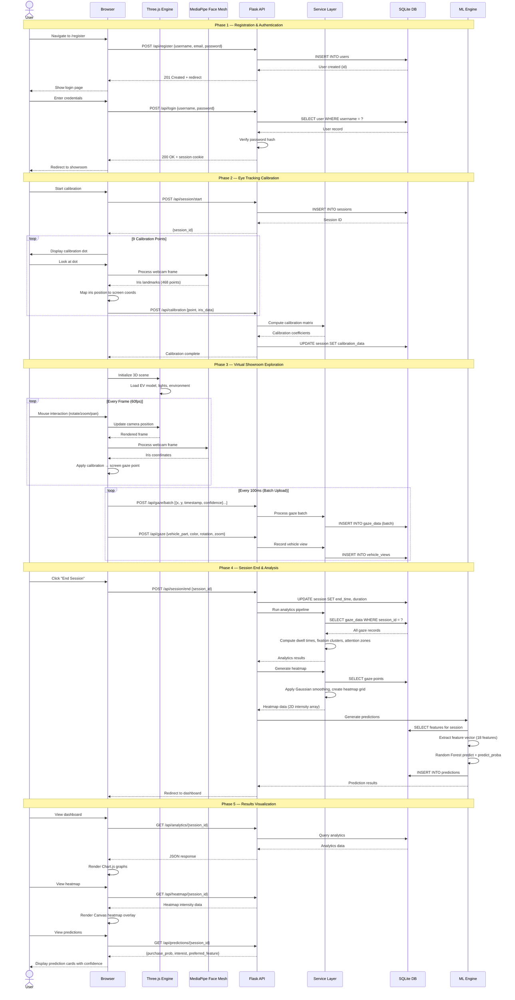

<
2. [Data Flow Diagram — Level 0](#2-data-flow-diagram--level-0)
3. [Data Flow Diagram — Level 1](#3-data-flow-diagram--level-1)
4. [Use Case Diagram](#4-use-case-diagram)
5. [Component Diagram](#5-component-diagram)
6. [Entity-Relationship Diagram](#6-entity-relationship-diagram)
7. [Sequence Diagram](#7-sequence-diagram)

---

## 1. High-Level Architecture Diagram

This diagram shows the overall system architecture — from the browser-based frontend through the Flask API to the backend services and database.

---

## 2. Data Flow Diagram — Level 0

The context-level DFD shows the system as a single process with its external entities and data flows.

---

## 3. Data Flow Diagram — Level 1

The Level 1 DFD decomposes the system into its major sub-processes and internal data stores.

---

## 4. Use Case Diagram

Shows the interactions between actors (User, Admin) and system use cases.

```mermaid
graph TB
    subgraph "SmartEV Vision System"
        UC1["Register Account"]
        UC2["Login / Logout"]
        UC3["Enter Virtual Showroom"]
        UC4["Calibrate Eye Tracker"]
        UC5["Explore EV Models"]
        UC6["Change Vehicle Color"]
        UC7["View Analytics Dashboard"]
        UC8["View Attention Heatmap"]
        UC9["View ML Predictions"]
        UC10["View Session History"]
        UC11["Manage Users"]
        UC12["Train ML Model"]
        UC13["Export Data"]
        UC14["View System Statistics"]
    end

    User(("👤 User"))
    Admin(("👨‍💼 Admin"))

    User --> UC1
    User --> UC2
    User --> UC3
    User --> UC4
    User --> UC5
    User --> UC6
    User --> UC7
    User --> UC8
    User --> UC9
    User --> UC10

    Admin --> UC2
    Admin --> UC11
    Admin --> UC12
    Admin --> UC13
    Admin --> UC14

    UC3 -. "<<includes>>" .-> UC4
    UC5 -. "<<includes>>" .-> UC6
    UC7 -. "<<extends>>" .-> UC8
    UC7 -. "<<extends>>" .-> UC9

    style User fill:#BBDEFB,stroke:#1565C0,color:#000
    style Admin fill:#FFCDD2,stroke:#C62828,color:#000

    style UC1 fill:#E8F5E9,stroke:#388E3C,color:#000
    style UC2 fill:#E8F5E9,stroke:#388E3C,color:#000
    style UC3 fill:#E3F2FD,stroke:#1976D2,color:#000
    style UC4 fill:#E3F2FD,stroke:#1976D2,color:#000
    style UC5 fill:#E3F2FD,stroke:#1976D2,color:#000
    style UC6 fill:#E3F2FD,stroke:#1976D2,color:#000
    style UC7 fill:#FFF3E0,stroke:#E65100,color:#000
    style UC8 fill:#FFF3E0,stroke:#E65100,color:#000
    style UC9 fill:#FFF3E0,stroke:#E65100,color:#000
    style UC10 fill:#FFF3E0,stroke:#E65100,color:#000
    style UC11 fill:#FCE4EC,stroke:#C62828,color:#000
    style UC12 fill:#FCE4EC,stroke:#C62828,color:#000
    style UC13 fill:#FCE4EC,stroke:#C62828,color:#000
    style UC14 fill:#FCE4EC,stroke:#C62828,color:#000
```

---

## 5. Component Diagram

Shows all software modules/components and their inter-dependencies.

---

## 6. Entity-Relationship Diagram

Shows the five database tables and their relationships.

---

## 7. Sequence Diagram

Shows the typical end-to-end user flow from registration through to viewing results.

---

## Diagram Legend

| Symbol | Meaning |
|--------|---------|
| Rectangle | Process / Module / Component |
| Cylinder | Data Store (Database) |
| Circle | External Entity (Actor) |
| Solid arrow | Data flow / Function call |
| Dashed arrow | Return / Response |
| Diamond (ER) | Relationship |

---

*All diagrams created with [Mermaid](https://mermaid.js.org/) — rendered natively in GitHub, VS Code, and most modern Markdown viewers.*
]]>
