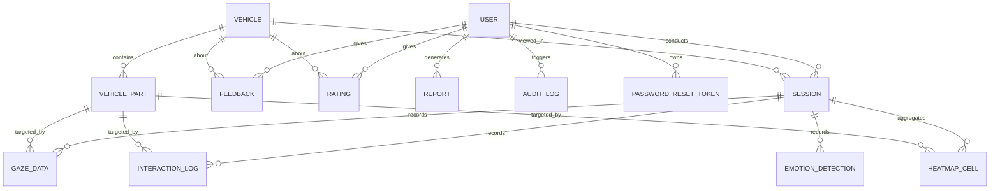

# SmartEV Vision — ER Diagram (Phase 0)

Authoritative schema: `apps/api/prisma/schema.prisma`.

**Active in Phase 0:** `User`, `PasswordResetToken`, `AuditLog` (exercised by the auth API);
`Vehicle`, `VehiclePart`, `Session` (seeded, surfaced read-only in dashboards).

**Inert until their feature phase:** `GazeData`, `InteractionLog`, `HeatmapCell`,
`EmotionDetection`, `Feedback`, `Rating`, `Report` — schema + seed only, no behavior yet.
