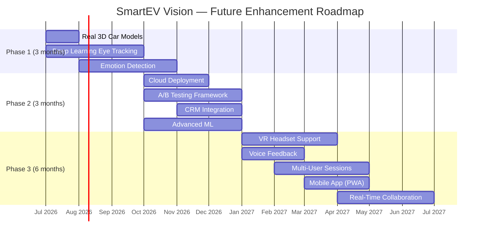

<![CDATA[# SmartEV Vision — Future Enhancements

> This document outlines potential future enhancements to the SmartEV Vision platform, organized by priority and feasibility. Each enhancement includes a technical approach, expected impact, and difficulty assessment.

---

## Summary Table

| # | Enhancement | Impact | Difficulty | Priority |
|---|------------|--------|------------|----------|
| 1 | Real VR Headset Support (WebXR) | 🔴 High | 🟡 Medium | P1 |
| 2 | Deep Learning Eye Tracking (CNN) | 🔴 High | 🔴 Hard | P1 |
| 3 | Emotion Detection (Facial Expression) | 🔴 High | 🔴 Hard | P1 |
| 4 | Voice Feedback Integration | 🟡 Medium | 🟡 Medium | P2 |
| 5 | A/B Testing Framework | 🔴 High | 🟡 Medium | P2 |
| 6 | Cloud Deployment (AWS/GCP) | 🟡 Medium | 🟡 Medium | P2 |
| 7 | Real 3D Car Models (GLTF/GLB) | 🔴 High | 🟢 Easy | P1 |
| 8 | Multi-User Sessions | 🟡 Medium | 🔴 Hard | P3 |
| 9 | Real-Time Collaboration | 🟡 Medium | 🔴 Hard | P3 |
| 10 | Mobile App Version | 🟡 Medium | 🟡 Medium | P3 |
| 11 | CRM System Integration | 🟡 Medium | 🟡 Medium | P2 |
| 12 | Advanced ML (Neural Networks / Transformers) | 🔴 High | 🔴 Hard | P2 |

---

## 1. Real VR Headset Support (WebXR)

### Description

Extend the current browser-based 3D experience to support immersive VR headsets (Meta Quest, HTC Vive, Valve Index) through the **WebXR Device API**. Users wearing VR headsets would experience a fully immersive virtual showroom where they can physically walk around the EV model, lean in to inspect details, and interact with components using VR controllers. This transforms the application from a screen-based simulation into a true virtual reality experience.

### Technical Approach

- **WebXR Integration:** Replace the current `OrbitControls` with `XRControllerModelFactory` and WebXR session management. Three.js natively supports WebXR through `renderer.xr.enabled = true` and `XRSession` APIs.
- **Controller Mapping:** Map VR controller inputs (trigger, grip, thumbstick) to vehicle interaction gestures — trigger to select parts, grip to grab and rotate, thumbstick for teleportation navigation.
- **Stereoscopic Rendering:** Enable dual-camera rendering for left/right eye views with proper interpupillary distance (IPD) adjustment.
- **Room-Scale Tracking:** Leverage the 6DOF (six degrees of freedom) tracking from the headset for positional movement around the vehicle model.
- **Built-in Eye Tracking:** Headsets like Meta Quest Pro and HTC Vive Pro Eye include native eye tracking hardware, which could replace or supplement the webcam-based MediaPipe solution with significantly higher accuracy (0.5°–1.0° angular resolution vs. current 2°–5°).

### Expected Impact

- **Immersion:** Dramatically increased sense of presence and engagement, leading to more natural and authentic customer reactions.
- **Data Quality:** VR-native eye tracking provides superior precision and eliminates head-movement calibration issues.
- **Market Differentiation:** Positions SmartEV Vision as a premium customer research platform.

### Difficulty Level

🟡 **Medium** — Three.js WebXR support is mature. Primary challenges are headset-specific testing, motion sickness mitigation, and UI redesign for 3D spatial interfaces.

---

## 2. Deep Learning Eye Tracking (CNN-Based)

### Description

Replace or augment the current MediaPipe iris landmark approach with a dedicated **Convolutional Neural Network (CNN)** trained specifically for gaze estimation. The current system infers gaze direction from 5 iris landmarks, which provides reasonable accuracy but is limited by the geometric model's assumptions. A deep learning approach can learn complex mappings from eye appearance directly to gaze coordinates, capturing nuances that rule-based methods miss.

### Technical Approach

- **Model Architecture:** Implement a gaze estimation CNN based on architectures like **GazeNet** or **iTracker**. The network takes cropped eye region images (60×36 pixels) as input and outputs (x, y) gaze coordinates.
- **Dataset:** Train on public gaze estimation datasets such as **MPIIGaze** (213,659 images), **GazeCapture** (2.5M frames), or **Columbia Gaze** (5,880 images with precise annotations).
- **Transfer Learning:** Use a pre-trained ResNet-18 or MobileNetV2 backbone, fine-tuning only the final regression layers for gaze coordinates.
- **Deployment:** Convert the trained model to **TensorFlow.js** format using `tensorflowjs_converter`, enabling real-time inference in the browser at 30+ FPS on modern GPUs.
- **Hybrid Approach:** Use MediaPipe for face detection and eye region cropping, then pass the cropped eye patches to the CNN for precise gaze estimation.

### Expected Impact

- **Accuracy:** Expected improvement from current ~3°–5° angular error to ~1.5°–2.5° using person-specific calibration.
- **Robustness:** CNNs are more resilient to lighting variations, partial occlusions, and non-frontal head poses.
- **Generalization:** Better performance across diverse eye shapes, glasses wearers, and ethnic groups.

### Difficulty Level

🔴 **Hard** — Requires significant ML expertise, GPU training infrastructure, large annotated datasets, and careful optimization for real-time browser inference.

---

## 3. Emotion Detection (Facial Expression Analysis)

### Description

Add a **facial emotion recognition** module that captures users' emotional responses (surprise, interest, confusion, delight, neutral) in real-time as they explore EV models. Combined with gaze data, this creates a multi-dimensional understanding of customer reactions — not just *where* they look, but *how they feel* about what they see.

### Technical Approach

- **Face Detection:** Leverage the existing MediaPipe Face Mesh pipeline (already running for eye tracking) to extract the face region.
- **Emotion Classification:** Deploy a CNN classifier (e.g., **FER-2013** trained VGG or a MobileNet variant) that classifies 7 basic emotions: happy, sad, angry, surprise, fear, disgust, neutral.
- **Valence-Arousal Model:** Optionally, predict continuous valence (positive/negative) and arousal (calm/excited) scores for more nuanced emotional analysis.
- **Temporal Analysis:** Apply a sliding window (1–3 seconds) to smooth transient expressions and identify sustained emotional responses.
- **Database Schema:** Add an `emotions` table linked to sessions with columns: `timestamp_ms`, `emotion_label`, `confidence`, `valence`, `arousal`.
- **Dashboard Integration:** Display emotion timeline charts alongside gaze heatmaps — showing emotional peaks correlated with specific vehicle views.

### Expected Impact

- **Insight Depth:** Enables understanding *why* a customer lingered on a feature — was it admiration (positive) or confusion (negative)?
- **Design Validation:** EV designers can correlate emotional responses with specific design elements.
- **Marketing Intelligence:** Identify which features generate the strongest positive reactions for marketing emphasis.

### Difficulty Level

🔴 **Hard** — Real-time emotion detection with acceptable accuracy (~65–70% on FER-2013) requires careful model selection, and webcam-quality images add noise compared to controlled lab conditions.

---

## 4. Voice Feedback Integration

### Description

Enable users to provide **verbal feedback** during their showroom exploration, which is transcribed in real-time and analyzed for sentiment and key themes. This adds a qualitative dimension to the quantitative gaze and interaction data.

### Technical Approach

- **Speech Recognition:** Use the **Web Speech API** (`SpeechRecognition` interface) for real-time speech-to-text conversion, which runs natively in Chrome and Edge without external APIs.
- **Keyword Extraction:** Apply NLP techniques (TF-IDF or KeyBERT) to extract key terms and topics from transcribed text.
- **Sentiment Analysis:** Use a pre-trained sentiment model (VADER for rule-based or a lightweight BERT variant) to classify feedback as positive, negative, or neutral.
- **Timestamp Synchronization:** Map each utterance to the concurrent gaze position and vehicle view, enabling correlation like "user said 'love this' while looking at the wheel design."
- **Feedback Prompts:** Optionally, trigger voice prompts at key moments (e.g., after 30 seconds on a specific view: "What do you think of this angle?").

### Expected Impact

- **Rich Qualitative Data:** Complements quantitative metrics with natural language insights.
- **User-Friendly:** More natural than post-session surveys; captures in-the-moment reactions.
- **Theme Discovery:** Automatic keyword extraction reveals common themes across many sessions.

### Difficulty Level

🟡 **Medium** — Web Speech API is well-supported. Main challenges are noise handling, accent/dialect variations, and privacy considerations for audio recording.

---

## 5. A/B Testing Framework

### Description

Build an **A/B testing engine** that allows EV designers to create controlled experiments — showing different design variants (colors, shapes, feature placements) to different user cohorts and statistically comparing their gaze and engagement patterns.

### Technical Approach

- **Variant Management:** Create an admin interface for defining experiments with 2+ variants. Each variant specifies a different 3D model configuration (color, material, component visibility).
- **User Assignment:** Implement deterministic random assignment using `hash(user_id + experiment_id) % num_variants` to ensure consistent variant assignment per user.
- **Statistical Engine:** Implement hypothesis testing (two-sample t-test, chi-squared test) to compare engagement metrics across cohorts with configurable significance levels (α = 0.05).
- **Sample Size Calculator:** Estimate required sample size based on minimum detectable effect (MDE), statistical power (1 - β = 0.80), and baseline conversion rates.
- **Dashboard:** Visualize experiment results with confidence intervals, p-values, and effect sizes (Cohen's d).

### Expected Impact

- **Scientific Rigor:** Enables data-driven design decisions with statistical confidence rather than subjective opinion.
- **Iteration Speed:** Rapid comparison of design alternatives reduces the EV design feedback cycle.
- **Industry Value:** A/B testing is a proven methodology that automotive companies already use in digital marketing — extending it to 3D product design is novel.

### Difficulty Level

🟡 **Medium** — The statistical methods are well-established. Complexity lies in the variant management system and ensuring sufficient sample sizes for statistical power.

---

## 6. Cloud Deployment (AWS/GCP)

### Description

Migrate the application from local deployment to a **cloud infrastructure** for scalability, reliability, and global accessibility. This enables the platform to serve multiple concurrent users, persist data reliably, and support enterprise deployment scenarios.

### Technical Approach

- **Compute:** Deploy the Flask application on **AWS Elastic Beanstalk** or **Google Cloud Run** for auto-scaling container-based hosting.
- **Database:** Migrate from SQLite to **AWS RDS (PostgreSQL)** or **Cloud SQL** for concurrent write support, automated backups, and horizontal read replicas.
- **Static Assets:** Serve 3D models and static files through **AWS CloudFront** or **Google Cloud CDN** for low-latency global delivery.
- **Storage:** Use **S3** or **Cloud Storage** for ML model artifacts, exported reports, and user uploads.
- **CI/CD:** Implement GitHub Actions pipeline for automated testing, building Docker images, and deploying to cloud.
- **Monitoring:** Add **CloudWatch** or **Cloud Monitoring** for application metrics, error tracking, and alerting.

### Expected Impact

- **Scalability:** Support hundreds of concurrent users (vs. current single-instance limitation).
- **Reliability:** 99.9% uptime SLA with managed services and automatic failover.
- **Accessibility:** Users can access the platform from anywhere without local installation.

### Difficulty Level

🟡 **Medium** — Cloud deployment patterns are well-documented. Key challenges are database migration, cost management, and security configuration (HTTPS, IAM, CORS).

---

## 7. Real 3D Car Models (GLTF/GLB Import)

### Description

Replace the current programmatic Three.js geometries (boxes, cylinders) with **photorealistic 3D car models** in GLTF/GLB format. This dramatically improves visual fidelity and makes the showroom experience comparable to professional automotive configurators.

### Technical Approach

- **Model Sources:** Obtain 3D EV models from platforms like **Sketchfab** (free/paid), **TurboSquid**, or automotive OEM partnerships. Many EV manufacturers provide 3D assets for marketing.
- **GLTF Pipeline:** Use Three.js `GLTFLoader` (already in the tech stack) to load `.glb` files. Optimize models using **gltf-pipeline** or **glTF-Transform** to reduce polygon count (target: <500K triangles) and texture resolution (2K max).
- **PBR Materials:** Apply physically-based rendering materials (metalness, roughness maps) for realistic paint, glass, chrome, and rubber surfaces.
- **Model Decomposition:** Tag model parts (hood, wheels, headlights, interior) with named meshes so that gaze tracking can map to specific vehicle components.
- **LOD System:** Implement Level-of-Detail switching — high-poly model for close-up views, low-poly for zoomed-out overviews, maintaining 60 FPS.

### Expected Impact

- **Visual Quality:** Transformative improvement in showroom realism, making customer reactions more authentic and comparable to physical showroom experiences.
- **Part-Level Analytics:** Named mesh parts enable precise analytics like "users spend 35% of gaze time on the headlight design."
- **Configurator Features:** Opens the door for part-swapping (different wheel designs, spoilers, bumpers).

### Difficulty Level

🟢 **Easy** — Three.js GLTFLoader is mature and well-documented. The main effort is sourcing, optimizing, and tagging the 3D models rather than coding.

---

## 8. Multi-User Sessions

### Description

Enable **multiple users to simultaneously explore the showroom** in independent sessions, with an admin able to monitor all active sessions in real-time. This is essential for conducting user studies with multiple participants and for scaling the platform.

### Technical Approach

- **WebSocket Layer:** Replace HTTP polling with **Flask-SocketIO** (backed by `eventlet` or `gevent`) for real-time bidirectional communication between browser clients and the server.
- **Session Isolation:** Each user gets an independent WebSocket room (`room=session_id`) ensuring gaze data streams are isolated.
- **Admin Live View:** Build an admin dashboard that subscribes to all active rooms and displays live gaze feeds, session durations, and participant status in real-time.
- **Concurrent Database Access:** Migrate from SQLite (single-writer limitation) to **PostgreSQL** or use SQLite in WAL (Write-Ahead Logging) mode for concurrent write support.
- **Resource Management:** Implement connection pooling and rate limiting to prevent server overload from multiple simultaneous eye-tracking data streams.

### Expected Impact

- **Research Scale:** Enables conducting user studies with 10–50 participants simultaneously.
- **Efficiency:** Researchers can observe multiple sessions from a single admin dashboard.
- **Enterprise Readiness:** Multi-user support is a prerequisite for commercial deployment.

### Difficulty Level

🔴 **Hard** — Real-time WebSocket management, concurrent database writes, and session isolation introduce significant architectural complexity and require thorough testing under load.

---

## 9. Real-Time Collaboration

### Description

Allow multiple users to **share a single virtual showroom** where they can see each other's avatars, gaze indicators, and interact collaboratively — enabling remote design review sessions between designers, marketers, and focus group participants.

### Technical Approach

- **State Synchronization:** Use WebSocket broadcasts to synchronize camera positions, gaze indicators, and pointer positions across all participants in a shared room.
- **Avatar System:** Represent each participant with a simple avatar (colored sphere or head model) positioned based on their camera viewpoint.
- **Gaze Sharing:** Optionally overlay other participants' gaze points as colored dots (each user gets a unique color) on the shared scene.
- **Voice Chat:** Integrate **WebRTC** peer-to-peer audio for voice communication during collaborative sessions.
- **Annotations:** Allow users to place 3D sticky notes or markers on the vehicle model that persist for all participants.
- **Conflict Resolution:** Implement optimistic concurrency for shared state — last-write-wins for individual properties (camera, color), merge for additive data (annotations).

### Expected Impact

- **Remote Collaboration:** Enables globally distributed teams to review EV designs together in a shared virtual space.
- **Focus Groups:** Facilitators can guide multiple participants through the showroom while observing their collective reactions.
- **Cost Savings:** Eliminates the need for physical prototypes and in-person design reviews.

### Difficulty Level

🔴 **Hard** — Real-time state synchronization, WebRTC integration, conflict resolution, and maintaining 60 FPS with multiple users' data are significant engineering challenges.

---

## 10. Mobile App Version

### Description

Develop a **native mobile application** (iOS/Android) or a **Progressive Web App (PWA)** that brings the SmartEV Vision showroom to smartphones and tablets. Mobile devices have front-facing cameras well-suited for face/eye tracking and support touch-based 3D interaction.

### Technical Approach

- **PWA Route:** Convert the existing web app into a PWA with `manifest.json`, service workers for offline caching, and `Add to Home Screen` capability. This requires minimal code changes and maintains a single codebase.
- **Native Route (Alternative):** Use **React Native** with `expo-three` for 3D rendering and `react-native-camera` for eye tracking. Or use **Flutter** with a WebView for Three.js and platform channels for camera access.
- **Touch Controls:** Replace mouse-based orbit controls with touch gestures — single-finger drag for rotation, pinch for zoom, two-finger drag for pan.
- **Mobile Eye Tracking:** MediaPipe Face Mesh works on mobile browsers. Optimize for lower camera resolutions (720p) and reduced processing power.
- **Responsive 3D:** Dynamically adjust model quality, texture resolution, and render resolution based on device capabilities (`navigator.deviceMemory`, `navigator.hardwareConcurrency`).

### Expected Impact

- **Accessibility:** Reaches the 60%+ of users who primarily browse on mobile devices.
- **Convenience:** Users can participate in studies from anywhere without a laptop.
- **Touch Data:** Touch interaction patterns (pinch zoom frequency, swipe direction) provide additional behavioral signals.

### Difficulty Level

🟡 **Medium** — PWA approach is straightforward. Native app requires additional platform expertise. Mobile eye-tracking accuracy is lower than desktop due to smaller screens and varied lighting.

---

## 11. Integration with CRM Systems

### Description

Connect SmartEV Vision with **Customer Relationship Management (CRM)** platforms like Salesforce, HubSpot, or Zoho CRM to automatically feed customer interest data and ML predictions into the sales pipeline.

### Technical Approach

- **REST API Connectors:** Build integration modules using CRM REST APIs:
  - **Salesforce:** Use Salesforce REST API with OAuth 2.0 for creating Leads/Contacts with custom fields for gaze metrics and predictions.
  - **HubSpot:** Use HubSpot API to create contacts and log engagement events.
  - **Generic Webhook:** Support any CRM through configurable webhooks that POST JSON payloads on session completion.
- **Data Mapping:** Define configurable field mappings between SmartEV Vision session data and CRM fields:
  - `purchase_probability` → CRM Lead Score
  - `preferred_feature` → CRM Interest Tags
  - `interest_level` → CRM Lead Status (Hot/Warm/Cold)
- **Event Triggers:** Automatically push data on configurable events: session complete, high purchase probability detected, or scheduled batch exports.
- **Admin Configuration:** Build an admin settings page for CRM credentials, field mapping, and trigger rules — no code changes required for new integrations.

### Expected Impact

- **Sales Efficiency:** Sales teams receive qualified leads with rich behavioral data, reducing cold-calling and improving conversion rates.
- **Closed-Loop Analytics:** Track the full funnel from VR showroom visit → CRM lead → actual purchase, enabling ROI measurement.
- **Enterprise Appeal:** CRM integration is often a mandatory requirement for enterprise software procurement.

### Difficulty Level

🟡 **Medium** — CRM APIs are well-documented but vary in authentication complexity. OAuth 2.0 flows and webhook reliability require careful implementation.

---

## 12. Advanced ML (Neural Networks / Transformers)

### Description

Upgrade the ML prediction engine from the current Random Forest classifier to **deep learning models** — including feed-forward neural networks, recurrent networks (LSTM/GRU) for temporal gaze sequences, and attention-based transformers for capturing complex interaction patterns.

### Technical Approach

- **Feed-Forward Network:** Replace Random Forest with a multi-layer perceptron (MLP) using PyTorch or TensorFlow:
  - Architecture: Input(18) → Dense(128, ReLU) → Dropout(0.3) → Dense(64, ReLU) → Dropout(0.2) → Output(3, Softmax)
  - Training: Adam optimizer, cross-entropy loss, learning rate scheduling
- **LSTM for Temporal Patterns:** Model gaze data as a time series — sequence of (x, y, confidence, pupil_size) tuples over the session duration.
  - Architecture: Input sequence → LSTM(128) → LSTM(64) → Dense(32) → Output(3)
  - Captures temporal patterns like "looked at front, then quickly shifted to interior" that feature-aggregated models miss.
- **Transformer Attention:** Apply self-attention to the gaze sequence:
  - Architecture: Positional encoding → 4-head self-attention × 2 layers → Feed-forward → Output
  - Attention weights reveal which moments in the session were most influential for the prediction — providing interpretability.
- **Ensemble:** Combine Random Forest, LSTM, and Transformer predictions through a meta-learner for robust final predictions.
- **AutoML:** Optionally integrate TPOT or Auto-sklearn for automated model selection and hyperparameter tuning.

### Expected Impact

- **Prediction Accuracy:** Expected improvement from ~78% (Random Forest) to ~85–90% (ensemble deep learning) based on literature benchmarks.
- **Temporal Intelligence:** LSTM/Transformer models capture the *sequence* of viewing behavior, not just aggregated statistics.
- **Interpretability:** Transformer attention weights show *which viewing moments* most influenced the prediction, providing actionable insights.

### Difficulty Level

🔴 **Hard** — Deep learning requires larger datasets (1000+ sessions), GPU training infrastructure, hyperparameter tuning expertise, and careful evaluation to avoid overfitting on small datasets.

---

## Implementation Roadmap



---

## Prioritization Matrix

```
                    HIGH IMPACT
                        │
    ┌───────────────────┼───────────────────┐
    │  Emotion Detection│  Real 3D Models   │
    │  Advanced ML      │  A/B Testing      │
    │  VR Headset       │  Deep Learning ET  │
    │                   │                   │
    │     HARD ─────────┼──────── EASY      │
    │                   │                   │
    │  Collaboration    │  Cloud Deploy     │
    │  Multi-User       │  CRM Integration  │
    │                   │  Mobile App       │
    │                   │  Voice Feedback   │
    └───────────────────┼───────────────────┘
                        │
                    LOW IMPACT
```

---

*This roadmap is a living document and should be updated as the project evolves, user feedback is collected, and new technologies emerge.*
]]>
