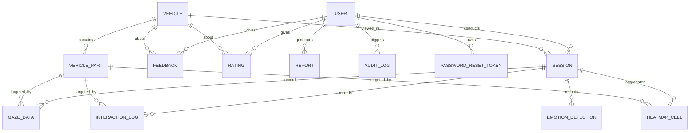

# SmartEV Vision — Enterprise Rebuild: Architecture & Phase 0 (Foundation) Design

- **Date:** 2026-06-27
- **Status:** Design approved by stakeholder; spec pending review
- **Branch:** `rebuild/enterprise-v2`
- **Scope of this document:** platform-wide target architecture + cross-cutting principles + phased roadmap, then the **detailed, buildable design for Phase 0 (Foundation)**. Later phases each get their own spec → plan → build cycle.

---

## 1. Context & Goal

SmartEV Vision is a VR + eye-tracking platform that lets customers explore electric vehicles in a virtual showroom while their **gaze and interactions are captured**, then turns that attention data into **design insights for EV manufacturers** (Tesla / Tata Motors / Hyundai / BYD / Mahindra-class buyers of the tool).

This rebuild replaces the legacy Flask + SQLite + vanilla-JS prototype with a **TypeScript-first, enterprise-structured web platform**, while **keeping the proven Python/scikit-learn analytics** as a dedicated internal service (the "hybrid" decision). The product should read as an enterprise SaaS tool an OEM's design-research team would actually license.

### Approved decisions (driving this design)
- **Build order:** Foundation first (this phase), then VR Showroom → Capture → Analytics → Dashboards → Feedback/Reports → Docs/Deploy.
- **Existing code:** Hybrid — new React/Node app; reuse the legacy scikit-learn analytics/heatmap as a Python **FastAPI** microservice (built in Phase 3).
- **VR engine:** React Three Fiber + WebXR (desktop-first, simulated gaze, headset optional later).
- **Approved defaults:** low-poly placeholder EV model initially; console-based password reset in dev; Docker Compose for Postgres.

---

## 2. Personas & Roles (RBAC)

Three roles, modeled as a `Role` enum on `User` (no duplicate "Admin" table):

| Role | Purpose | Access |
|------|---------|--------|
| **CUSTOMER** | Explores the VR showroom, leaves feedback/ratings | Own profile, own sessions & reports, showroom, feedback |
| **ANALYST** (Research Analyst) | OEM design-research user | **Read-only** aggregated analytics, heatmaps, customer insights, session statistics across all customers. No user/catalog admin. |
| **ADMIN** | Platform operator | Full control: user management, EV catalog (vehicles/parts) CRUD, reports/exports, system config, **audit-log review**. Superset of Analyst. |

Role-based landing after login: `CUSTOMER → /app`, `ANALYST → /insights`, `ADMIN → /admin`.

---

## 3. Target Architecture

```
┌────────────┐     httpOnly-cookie auth      ┌─────────────┐    typed HTTP    ┌──────────────┐
│  apps/web  │  ───────────────────────────► │   apps/api  │ ───────────────► │  services/ml │
│ React + TS │  ◄─────────────────────────── │ Node+Express│ ◄─────────────── │   FastAPI    │
│ Vite·R3F·  │           JSON / REST          │  TS·Prisma  │   analytics      │ scikit-learn │
│ Tailwind·  │                                └──────┬──────┘   (Phase 3)      └──────────────┘
│ FramerMotion│                                      │
└────────────┘                                 ┌─────▼─────┐
        ▲                                       │ PostgreSQL│
        └─── packages/shared (TS types, zod ────┴───────────┘
             contracts, GazeProvider interface)
```

- **apps/web** — React 18 + TS + Vite + Tailwind + React Three Fiber + Framer Motion. Talks to the API over REST with httpOnly-cookie auth.
- **apps/api** — Node + Express + TS + Prisma. **System of record**: owns auth, RBAC, catalog, sessions, feedback, reports, audit. Calls the ML service for analytics.
- **services/ml** — Python FastAPI + scikit-learn/NumPy/SciPy, reusing legacy `analytics.py` / `heatmap.py` / `ml_engine.py`. Stateless compute (engagement scoring, heatmap generation, preference prediction). **Stubbed in Phase 0, built in Phase 3.**
- **PostgreSQL** — primary datastore, Prisma-managed migrations.
- **packages/shared** — shared TS types, `zod` schemas, REST contract types, and the **`GazeProvider` interface** consumed by web + api.

### Cross-cutting principles
1. **TypeScript everywhere** in web/api/shared; Python confined to `services/ml` behind a typed HTTP contract.
2. **Enterprise layering in api:** `routes → controllers → services → repositories(Prisma)`. No business logic in route handlers.
3. **Reusable, documented UI components:** a design-system primitives layer + feature components; props documented.
4. **Modular EV catalog:** a vehicle = DB row(s) + a GLB asset + part rows. Adding a model needs **no code or architecture change** — the showroom loader is data-driven off `Vehicle`/`VehiclePart`.
5. **Pluggable gaze provider:** a `GazeProvider` interface in `packages/shared`. Phase 2 ships `SimulatedMouseGazeProvider`; `WebGazerProvider` / `TobiiProvider` drop in later with **zero changes to consumers**.
6. **Audit everything** security/admin-relevant via a central `audit()` service writing `AuditLog`.
7. **Per-phase Definition of Done:** functional + tested + documented before the next phase starts.

---

## 4. Phased Roadmap

| Phase | Title | Headline deliverable |
|-------|-------|----------------------|
| **0** | **Foundation** (this doc) | Running app: landing + 3-role auth + full DB + design system |
| 1 | VR Showroom | R3F scene, lighting, one EV with named interactive parts, free-look |
| 2 | Gaze & interaction capture | Simulated gaze (camera-ray/cursor → part hit-testing), session recording, logging APIs |
| 3 | Heatmaps & AI analytics | FastAPI ML service: 3D heatmap, density, engagement/interest/recommendation scoring |
| 4 | Dashboards | Admin + Analyst + Customer dashboards with live charts, KPIs, insights, filters |
| 5 | Feedback, sentiment & reports | Ratings/comments, sentiment, PDF/Excel export |
| 6 | Docs & deploy | Architecture/sequence/use-case/class diagrams, API docs, install/test/deploy guides; Vercel + Render |

---

## 5. Phase 0 — Foundation (detailed)

### 5.1 Repository & tooling
- Rebuild on `rebuild/enterprise-v2` off `main`. Legacy Flask app moves to `legacy/` (its scikit-learn code seeds `services/ml` in Phase 3). `main` keeps working until the rebuild lands.
- **pnpm workspaces** monorepo:

```
apps/web/          React + TS + Vite + Tailwind + R3F + Framer Motion
apps/api/          Node + Express + TS + Prisma
services/ml/       Python FastAPI (placeholder package + healthcheck only this phase)
packages/shared/   shared TS types, zod schemas, REST contracts, GazeProvider interface
prisma/            schema.prisma, migrations/, seed.ts
docs/              ER diagram, API docs, diagrams, guides
docker-compose.yml Postgres (local dev)
package.json       workspace root + scripts
```

- Root scripts: `dev` (web+api concurrently), `db:migrate`, `db:seed`, `lint`, `typecheck`, `test`.
- Tooling: TypeScript `strict`, ESLint + Prettier, Vitest (unit), Supertest (api integration), dotenv config, optional Husky pre-commit (lint + typecheck).

### 5.2 Database schema (Postgres + Prisma) — full normalized model

The **complete** schema ships in Phase 0 (migrated once, built on later). Only auth/user/audit tables are exercised by code this phase; the rest are schema + seed only until their feature phase.

**Enums:** `Role{ADMIN,ANALYST,CUSTOMER}`, `VehicleType{SEDAN,SUV,HATCHBACK,TRUCK,SPORTS}`, `PartCategory{EXTERIOR,INTERIOR,WHEELS,LIGHTING,BATTERY,INFOTAINMENT,DOORS,MIRRORS}`, `SessionStatus{ACTIVE,COMPLETED,ABANDONED}`, `InteractionType{HOVER,FOCUS,CLICK,OPEN,ROTATE,ZOOM}`, `ReportType{PDF,EXCEL}`, `AuditAction{LOGIN,LOGOUT,REGISTER,PASSWORD_RESET,ROLE_CHANGE,VEHICLE_CREATE,VEHICLE_UPDATE,VEHICLE_DELETE,REPORT_GENERATE,DATA_EXPORT}`.

**Models (fields abbreviated; all have `id`, `createdAt`):**

| Model | Key fields | Relationships |
|-------|------------|---------------|
| `User` | email (unique), passwordHash, name, role, age?, gender?, avatarUrl?, isActive, updatedAt | 1–* Session, Feedback, Rating, Report, AuditLog (actor), PasswordResetToken |
| `PasswordResetToken` | userId, tokenHash, expiresAt, usedAt? | *–1 User |
| `Vehicle` | slug (unique), name, make, modelName, year, type, batteryKwh, rangeKm, priceUsd, modelUrl, thumbnailUrl, description, isPublished, updatedAt | 1–* VehiclePart, Session, Feedback, Rating |
| `VehiclePart` | vehicleId, name, category, **meshName** (R3F hit-test id), description?, displayOrder | *–1 Vehicle; referenced by Gaze/Interaction/Heatmap |
| `Session` | userId, vehicleId, startedAt, endedAt?, durationSec?, device, status, engagementScore? | *–1 User, Vehicle; 1–* GazeData, InteractionLog, HeatmapCell, EmotionDetection |
| `GazeData` | sessionId, partId?, tMs, x, y, depth? | *–1 Session, VehiclePart |
| `InteractionLog` | sessionId, partId?, type, tMs, metadata(Json)? | *–1 Session, VehiclePart |
| `HeatmapCell` | sessionId, partId?, x, y, intensity | *–1 Session, VehiclePart (computed Phase 3) |
| `EmotionDetection` | sessionId, tMs, emotion, confidence | *–1 Session (simulated/optional) |
| `Feedback` | userId, vehicleId, sessionId?, comment?, favoriteFeature?, suggestion?, sentiment? | *–1 User, Vehicle, Session |
| `Rating` | userId, vehicleId, partId?, score(1–5) | *–1 User, Vehicle, VehiclePart |
| `Report` | generatedById (User), sessionId?, type, scope, fileUrl | *–1 User, Session |
| `AuditLog` | actorUserId?, action, entityType?, entityId?, metadata(Json)?, ip?, userAgent? | *–1 User |

**ER diagram** (also generated to `docs/diagrams/er-diagram.md`):



**Seed data:** one user per role (`admin@`, `analyst@`, `customer@`), 3 published EVs each with ~8 named parts, 5–10 synthetic completed sessions with gaze/interaction rows, a few feedback/ratings, and sample audit entries — enough to light up later dashboards.

### 5.3 Auth & RBAC
- **Endpoints** (`/api/v1`): `POST /auth/register`, `/auth/login`, `/auth/refresh`, `/auth/logout`, `/auth/forgot-password`, `/auth/reset-password`; `GET /auth/me`; `PATCH /users/me`; (admin) `GET /users`, `PATCH /users/:id/role`.
- **Tokens:** short-lived access JWT + refresh JWT, both **httpOnly + SameSite cookies**, with refresh rotation. **argon2** password hashing. **zod**-validated bodies (shared schemas).
- **Middleware:** `requireAuth`, `requireRole(...roles)`.
- **Forgot-password:** store hashed `PasswordResetToken` with expiry; mailer abstraction **logs the reset link to console in dev** (zero external setup); Resend/SMTP adapter for prod. *(approved)*
- Every auth event + role change + sensitive action writes an `AuditLog` row.

### 5.4 Frontend (web)
- **Design system:** Tailwind tokens — dark base (~`#0a0a0f`), **neon-blue `#00d4ff`** + violet/teal accents, glassmorphism utilities, Inter/Space Grotesk type scale, Framer Motion presets. Primitives: `Button`, `GlassCard`, `Input`/`Field`, `Badge`, `Navbar`, `Footer`, `Section`, `GradientText`, **`StatCard` (KPI)**, **`ChartCard`**, `Skeleton`, `Toast`, `Modal`. Props documented.
- **Routing** (React Router): public (`/`, `/login`, `/register`, `/forgot`, `/reset`) + protected role shells (`/app`, `/insights`, `/admin`) behind auth + role guards. Shared `AppShell` (sidebar + topbar + user menu), parametrized by role.
- **Landing page:** animated hero with interactive **R3F 3D EV preview** (low-poly placeholder, orbit + idle auto-rotate), feature highlights, "how it works", tech stack, about, CTA (Get started / Request demo), footer. Fully responsive.
- **Auth screens:** register/login/forgot/reset/profile — glassmorphic, validated, wired to API via a typed `apiClient` + `AuthContext`.
- **Dashboard shells:** role-aware shells rendering `StatCard`/`ChartCard` components populated with **seeded placeholder data**. *(Live analytics, real heatmaps, and customer insights are wired in Phase 3/4 — Phase 0 ships the shells + components only.)*

### 5.5 API documentation
- **OpenAPI 3** spec for the Phase 0 endpoints, served at `/api/docs` (Swagger UI) and exported to `docs/api/`. Grows each phase.

### 5.6 Testing (Phase 0)
- **api:** Vitest + Supertest integration tests for register/login/refresh/logout/forgot/reset, auth guard, role guard, and an audit-write assertion; unit tests for the auth service.
- **web:** Vitest + Testing Library tests for key primitives, auth-form validation, and route guards.
- Scripts: `pnpm test`, `pnpm typecheck`, `pnpm lint` all green.

### 5.7 Definition of Done (Phase 0)
`docker compose up` → `pnpm install` → `pnpm db:migrate && pnpm db:seed` → `pnpm dev`, then a user can: load the animated landing page; register; log in as each of the 3 seeded roles and get redirected to the correct shell; edit their profile; run the console password-reset flow; and view auto-generated API docs. All Phase 0 tests pass; ER diagram + auth API docs + run guide committed.

---

## 6. Out of scope for Phase 0
VR showroom interactions, gaze capture, live analytics/heatmap computation, dashboards with real data, feedback/sentiment, PDF/Excel reports, and deployment — all in later phases. Their **tables and component shells** exist now; their **behavior** does not.

## 7. Risks & mitigations
- **Two runtimes (Node + Python):** accepted for ML reuse; isolated in `services/ml` behind a typed HTTP contract, stubbed until Phase 3.
- **Placeholder 3D fidelity:** mitigated by the modular, data-driven catalog — real GLBs swap in without code changes.
- **Schema churn:** the full schema ships up front so migrations stabilize early; later phases add behavior, not core tables.
